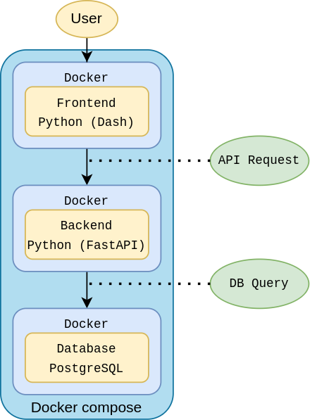

## Simple login page
This project is a basic login page for teaching purpose. Ignore complex concepts such as visible credentials, directories structure etc.

### Project structure

- Frontend: Python (Dash); a very simple way create a login page.
- Backend: Python (FastAPI) to receive the requests and access the database.
- Database: PostreSQL to store the user's credentials.

### Run
Considering that you already have `Docker` installed:
1. $ `git clone https://github.com/Padaw4NN/simple-login-fastapi.git`
2. $ `cd simple-login-fastapi`
3. $ `docker-compose up -d --build`

### Routes
While the containers are running, you can access these (local) pages/routes. In your browser, enter the links:
- Home: `0.0.0.0:8050/`
- Register (Sign Up): `0.0.0.0:8050/register`
- Login: `0.0.0.0:8050/login`

First, register and then login to test the API. To watch the behavior of each application, view its logs via `docker logs <container name here>`. You can make requests to test the API using `postman` and view the stored data using `pgadmin` or `dbeaver`.

### Doc
Please, take a look at the API document and explore it:
- `0.0.0.0:8081/docs`
